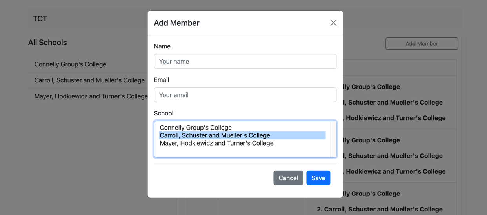
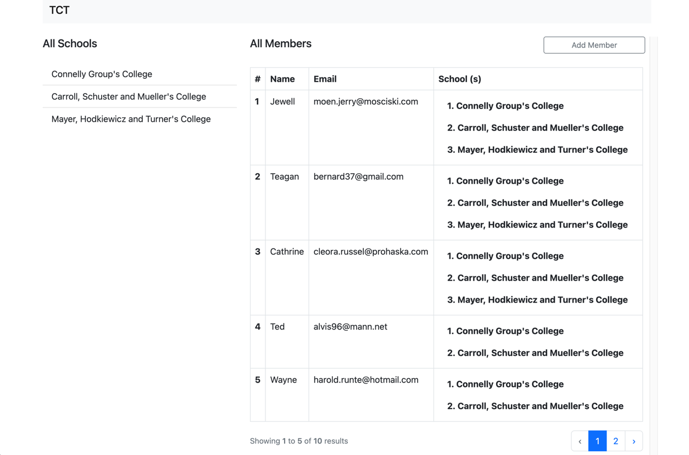
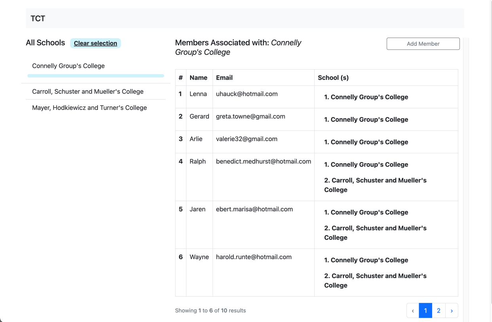

## TCT Members
<p>A Demo application for storing members.</p>

(Screenshot showing the view to add a new member)


(Shows the list of all members irrespective of their schools)


(Screenshot showing the list of members in the selected school)


### Tech stack and app foundation

- PHP 8.1 or higher, Laravel 10
- HTML, CSS, Bootstrap, Blade
- MySQL
- Docker (optional)

### How to run the app

1. Have the correct PHP version (8.1 or higher) and composer installed
2. Clone the project from https://github.com/ElijahBus/tct-members-01.git 
3. `cd` in the project root folder and run `composer install` to have all dependencies installed in the application
4. Create a `.env` file in the root folder and copy in it everything from `.env.example` then run `php artisan key:generate`
5. Run as well `npm install` and `npm run dev` to install and build npm packages
6. Configure properly the following keys in the `.env` file to connect to your MySQL Database. 
(If you have docker installed, you can run `docker-compose up -d` to have a MySQL container running with these configurations ):
   ````
   DB_CONNECTION=mysql
   DB_HOST=127.0.0.1
   DB_PORT=3306
   DB_DATABASE=tct_members
   DB_USERNAME=user # Not root 
   DB_PASSWORD=password
   ````
7. Run `php artisan migrate` to create the tables in the database and `php artisan db:seed` to have schools seeded in the database, and some dummy data to play with
8. Run `php artisan serve` , visit the app on the running port.

### Tests

You can manually test the application end-to-end, or run as well the feature tests with `php artisan test` command.
